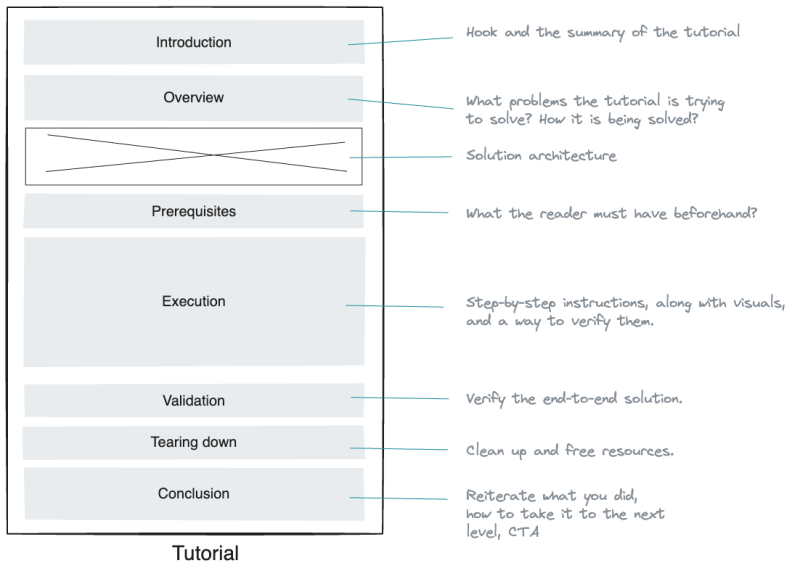
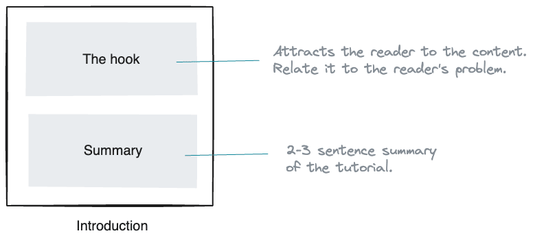
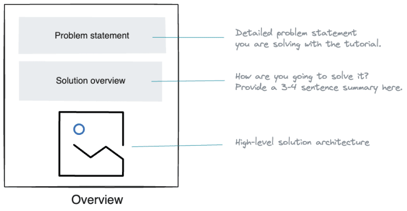
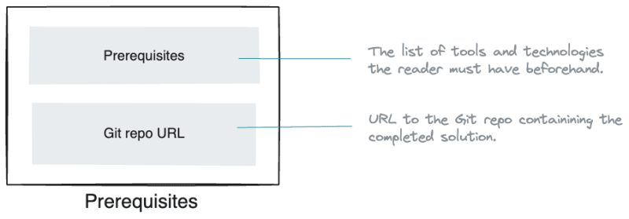
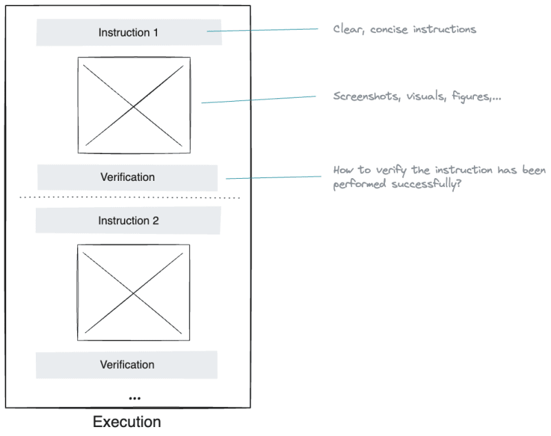
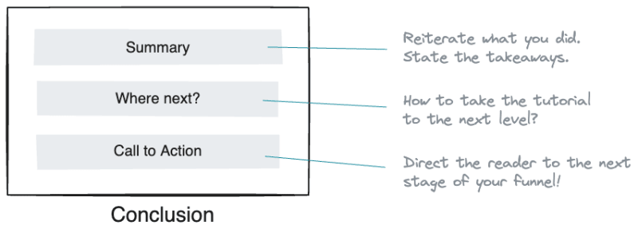

# Structure of a technical tutorial

source <https://dev.to/dunithd/how-to-structure-a-perfect-technical-tutorial-21h9>

##    Introduction - Essential summary of the tutorial

Introduces the tutorial and briefly explains what to expect in the content.

The hook and the summary are two elements you can include in the introduction 
to persuade the reader to continue reading the rest of the content.

- The hook: A few powerful sentences explaining why the reader should read the tutorial. 
In most cases, this can be the problem you are trying to solve, summarized in 2–3 sentences. 
The closer the hook gets to the reader's problem, the more readers continue reading.
- Summary of the article (TLDR): What can the reader expect in the tutorial? 
What's the outcome, and what are the takeaways?

##    Overview - The problem you are trying to solve with the tutorial

This is where you should describe two things in particular.

- Problem statement: What problem are you trying to solve with the tutorial? 
What benefits does it provide? Spend a paragraph or two mentioning these points.
- Solution architecture: How are you trying to solve the problems? 
What's the high-level solution architecture would look like? 
Mention the technology components you will use in the tutorial and highlight the data flow, 
connectivity, and user interactions among them.

Pick a fictitious use case and build your narrative around that. 
For example, to build a data pipeline from a database to a data lake, 
you can think of an online store use case.

Include visuals as much as possible in this section to provide more clarity to the reader. 
Include a high-level solutions architecture diagram capturing the tutorial scenario. 
That way, the reader can quickly capture what you are trying to do.

##    Prerequisites - What the reader must have before getting started.

You should mention what tools, technologies, and components the reader must have beforehand to complete the tutorial.
Use a bulleted list to mention them.

Furthermore, if certain tools are specific to a platform, highlight them as well. 

Finished code repo:
Help readers by pushing the completed solution code into a public Git repo 
and sharing its link 

##    Execution - Step-by-step instructions

This is where you provide step-by-step, Detailed guidance on each stage of the process or task.

Be sure to provide clear instructions in the order of their dependency. 
Add screenshots and diagrams as needed - the more, the merrier.

After each instruction, provide the reader the means to verify whether they have executed 
that properly.

##    Validation - How should the reader verify the tutorial outcome?

Once the reader finishes following instructions, you should provide a way of verifying 
the end-to-end solution.
You can include a screenshot or a visual portraying the final solution if the instructions 
were followed correctly.

Known issues and challenges: 
Sometimes, certain steps can't be completed due to technical challenges or limitations. 
Therefore, state any known issues and inform the reader about possible workarounds.

###    Tearing down - Cleaning up resources

Tearing down:
This is an optional step where you instruct the reader to destroy the environment 
and clean things up.

##    Conclusion - Takeaways

This is where we wrap things up.

Collecting the thoughts: Reiterate what you have accomplished in the tutorial. Spend the first paragraph of the conclusion wrapping things up.

Taking it to the next level: The tutorial might have shown a thin slice of a solution that addresses a simple problem. Suggest to the reader how to extend the solution to implement a real-world solution and take it to production. You don't have to be detailed here, but highlight a few potential steps necessary as a guideline.

Call to action: Dedicate the last paragraph to insert your CTA, driving satisfied readers to your *marketing funnel*.

---

Summary

Technical tutorials can be packaged and presented in various formats, 
including written articles, video tutorials, interactive online courses, 
or a combination of these mediums. 

You can use this post as a template to structure your tutorials, 
regardless of the format they are presented.

As a rule of thumb, try to cut your content at the 2000 word mark because attention 
span finite, and it isn't easy to navigate and follow a long document. 
Use a tutorial series if the content goes beyond 2000 words.

---

Conventions help shorten and clear up technical communication.

<https://conventionalcomments.org/>

<https://www.conventionalcommits.org/en/v1.0.0/>

<https://martinfowler.com/articles/ship-show-ask.html>

[Google Engineering Practices](https://github.com/google/eng-practices/blob/57c895ad4b09c8941288c04e44a08797b76b4d4d/review/reviewer/standard.md#mentoring)
